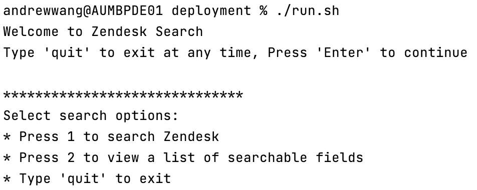
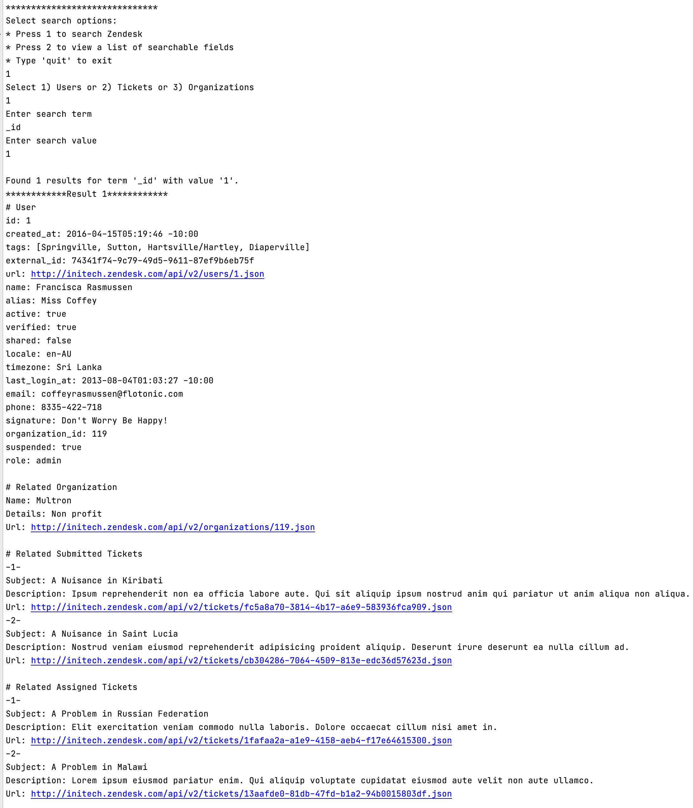
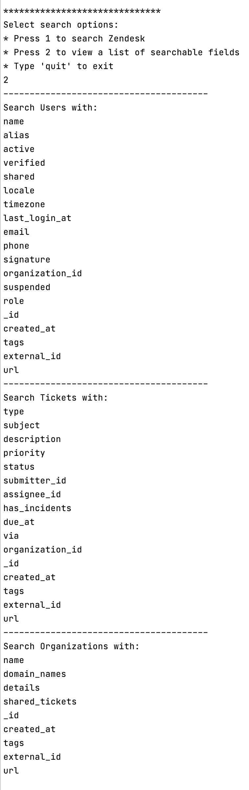
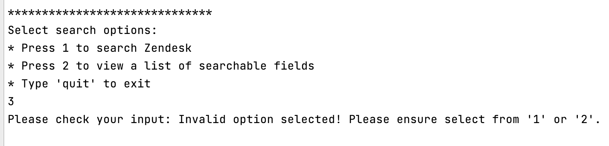
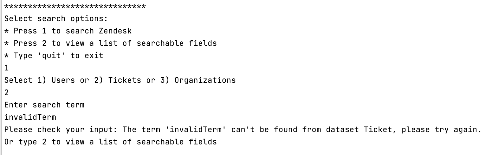
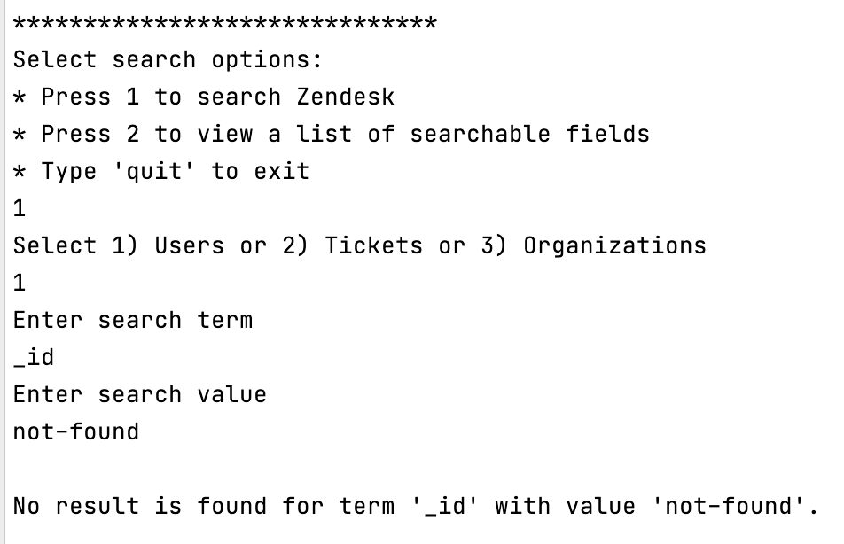

# Zendesk Power Data Searcher

# Overview

Using the provided data (tickets.json and users.json and organization.json) write a simple command line application to search the data and
return the results in a human readable format.

* Feel free to use libraries or roll your own code as you see fit. However, please do not use a database or full text search product as we
  are interested to see how you write the solution.
* Where the data exists, values from any related entities should be included in the results, i.e. searching organization by id should return
  its tickets and users.
* The user should be able to search on any field, full value matching is fine (e.g. "mar" won't return "mary").
* The user should also be able to search for empty values, e.g. where description is empty.

Search can get pretty complicated pretty easily, we just want to see that you can code a basic but efficient search application. Ideally,
search response times should not increase linearly as the number of documents grows. You can assume all data can fit into memory on a single
machine.

# Build And Run

This project requires `Maven 3.6` to build and `Java 8` to run. Please follow the following steps to build and run this project:

1. Clone this repository
   ```
   git clone https://github.com/1fan/zendesk-data-searcher.git
   ```
2. Go to the local directory and execute `clean-and-build.sh`.  
   This step will do a `mvn clean install` and move the jar file and related files(config files, sample json files, etc) into a new
   folder `./deployment`

    ```
    $ cd zendesk-data-searcher
    $ ./clean-and-build.sh
    ```
   After this step, you should be able to see a new 'deployment' folder with the following structure:
    ```
    .
    ..
    +-- datasearcher-0.0.1-SNAPSHOT.jar
    +-- run.sh
    +-- config
    |   +-- application.properties
    |   +-- organization.json
    |   +-- users.json
    |   +-- tickets.json
    ```   

3. Go to the `./deployment` folder.\
   You can change the configuration if needed. By default, configuration file and json files are all put in `./config` folder, you can
   replace the sample files with your real file. If the file name is changed, you can change the applciation.properties to specify the file
   path. \
   For instance, if you put a `users-2021-07.json` file into the `config` folder and want to use it instead of `users.json`, just update
   the `users.filepath` entry in applciation.properties to

   ```
   users.filepath=users-2021-07.json
   ```
4. Run the applciation with
   ```
   ./run.sh
   ```
   You can also apply different JVM options by updating the run.sh script as per your requirements.

Or can just open the project in IDE and start it.

# Search Demo

* Introduction
  
* Select a dataset and do the search.
  
* Display all searchable fields
  
* Option is invalid
  
* Term is invalid
  
* No Result is available
  

# Assumptions

* The field name to be searched should be exactly the same as the field in the json file. \
  For instance, if the field in the json is "_id", you should also type "_id" to search, otherwise the search will fail.
* Assume the json files are valid JSON file, and the format matches the model classes. \
  Currently json files containing the following field types are supported:
    - Number
    - String
    - Boolean
    - Array of above.
* JSON files should be provided. If file is not provided, the default files in the jar will be used.
* When search on the list field (tags, domain_names, etc), only one value can be searched. For instance, you can search on the field `tags`
  with value `'tagValue'`, but not on field "tag" with value `['tag1', 'tag2']`

# Tradeoff

This implementation used a "Lazy Init" mode to initialize the indexes - the indexes will only be initialized when it's started to be used.
Thus the first search will be slower than the subsequence operations because the JSON files will be parsed and indexes will be built in this
stage.

# How Text Search works?

This implementation is inspired by Inverted Index(https://www.geeksforgeeks.org/inverted-index/
and https://nlp.stanford.edu/IR-book/html/htmledition/a-first-take-at-building-an-inverted-index-1.html). The key data structure of my
implementation is a `Map<String, Map<String, List<Integer>>>`

* Key: the field name.
* Value: a map containing the field values and their occurrences.
    * key: field value
    * value: List of Integer represents the indexes of json that this value occurs.

For instance, when we read a JSON user1:

```
{
    "_id": 1,
    "active": true,
    "tags": [
      "Springville",
      "Diaperville"
    ],
    "name":"name1"
  }
```

the User index will be built as

```
{
    "_id"={
        "1"=[0]
    },
    "active"={
        "true"=[0]
    },
    "tags":{
        "Springville"=[0],
        "Diaperville"=[0]
    },
    "name"={
        "name1"=[0]
    }
}
```

Then the second JSON user 2 is read:

```
{
    "_id": 2,
    "tags": [
      "Springville",
      "Foxworth"
    ],
    "active":"true"
  }
```

The User index will be updated to

```
{
    "_id"={
        "1"=[0],
        "2"=[1]
    },
    "active"={
        "true"=[0,1]
    }
    "tags":{
        "Springville"=[0,1],
        "Diaperville"=[0],
        "Foxworth"=[1]
    },
    "name"={
        "name1"=[0],
        ""=[1]
    }
}
```

Thus we can easily get all occurrences of the given field with the given value

# How Ticket, User and Organization are linked?

Based on the dataset, I found the following linkage among User, Ticket and Organization:

* Ticket
    - 1 Ticket can link to 1 User as submitter where Ticket.submitter_id equals to User._id;
    - 1 Ticket can link to 1 User as assignee where Ticket.assignee_id equals to User._id;
    - 1 Ticket can link to 1 Organization where Ticket.organization_id equals to Organization._id;
* Organization
    - 1 Organization can link to multiple Tickets where Organization._id equals to Ticket.organization_id;
    - 1 Organization can link to multiple Users where Organization._id equals to User.organization_id;
* User
    - 1 User can link to multiple Tickets as submitter where User._id equals to Ticket.submitter_id;
    - 1 User can link to multiple Tickets as assignee where User._id equals to Ticket.assignee_id;
    - 1 User can link to 1 Organization where User.organization_id equals to organization._id;

Based on the linkage defined above, we can easily search on related datasets.

# Performance Analysis

Please read [here](PerformanceAnalysis.md) for more information.

# Future Enhancement

* Support time search \
  Currently the timestamp is simply regarded String and is not parsed as Time. In the future, we can parse it to ZonedDateTime and support
  user to search for a desired date time. For instance, search Ticket due_at 2021-01-01 UTC.
* Support range search \
  Currently the search only matches the exact value. We can make it support a range search. For instance, search on User whose
  organization_id is among [100, 101, 102, 103], or Tickets created_at between (2021-01-01T00:00:00 UTC, 2021-01-07T00:00:00: UTC)
* Make summary key fields configurable \
  In the current implementation, the summary of a dataset is restricted to a certain hardcoded key fields. For instance, the summary of User
  will only contain 'name', 'alias' and 'url'. We can make the key fields configurable to cater for different scenarios, so that we can
  display different summary under different circumstances. 